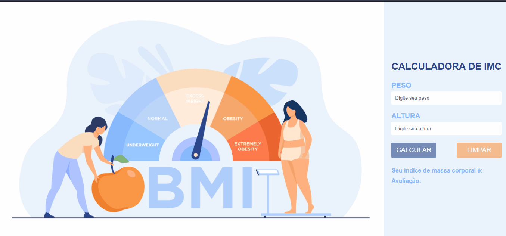

<h1 align="center"> Calculadora de Imc </h1>

 Projeto criado para praticar javascript onde você consegue calcular quanto está seu índice de massa corporal fornecendo a altura e peso. 

<h2 align="center"> Sobre o Projeto </h2>

Ele foi criado utilizando HTML, CSS e Javascript.

 O layout foi posicionado utilizando flexbox. 

 O javascript foi responsável por:
<ul>
    <li> Pegar os dados fornecidos pelo usuário </li>
    <li> Calcular o IMC </li>
    <li> Colocar na tela o resultado do imc e avaliação </li>
    <li> Limpar os valores dos campos inputs quando clicado no botão reset </li>
</ul>

<h2> Autor </h2>

 Hamilton de Souza 

 
 

 Crédito da imagem : <a href="https://br.freepik.com/vetores/pessoas">criado por pch.vector-br</a>

